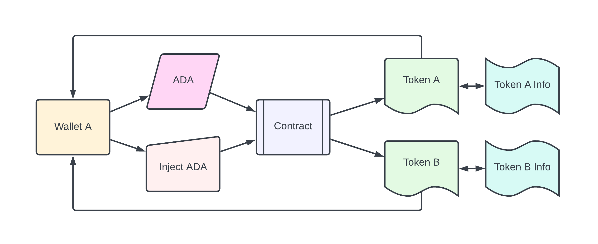
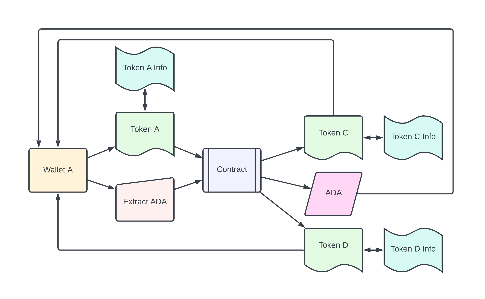
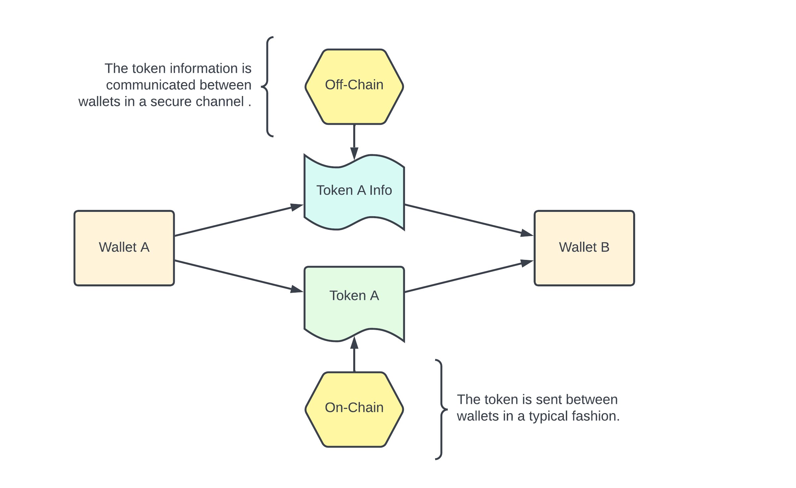

# Convert Expression

A contract that allows the minting and burning of tokens if and only if they satisfy the transformation equation

$$ g^{r (K_{i} + 1)} \prod_{j=0}^{M} g^{z_{j}} = g^{z_{b}} g^{rK_{j}} \prod_{i=0}^{N} g^{z_{i}} \mod q $$

where 

$$z_{b} = r + cb$$

$$z_{i} = r\lambda_{i} +c\alpha_{i}$$

$$z_{j} = r\lambda_{j} +c\alpha_{j}$$

$$K_{i} = \sum_{i=0}^{N} \lambda_{i}$$

$$K_{j} = \sum_{j=0}^{M} \lambda_{j}$$

and the token name equation

$$n = H(H(v)+m)$$

$$n \mod v \mod q' = 0$$

where $H$ is the sha3_256 hash function. The constants $g$, $r$, $c$, $q$, and $q'$ are public. The values $v$, $\lambda$, $\alpha$, and $m$ are secret.

A detailed [docs folder](documentation/summary.md) exists for further explaination.

## Building

The `start_info.json` file holds the starter token information.

### Example start_info.json file

```json
{
  "__comment1__": "This is the starter token for the lock contract",
  "starterPid": "ac74c28dcc6b051133f28ebb38cebfaf569f73a0b19ac8b9752c3796",
  "starterTkn": "01c0350934754552b043184ca68df84b9359dbff2fd410a5eef03f7611ebc9df"
}
```

Run the `complete_build.sh` script to build the contract and autopopulate the datum. This script requires `aiken` on path to work.

```bash
./complete_build.sh
```

## Testing

I will try to keep the tests up-to-date. Run the test suite with the command below.

```bash
aiken check
```

## Use

A [scripts folder](scripts/README.md) exists for more information on how to use the contract. There are two endpoints inside the contract, injection and extraction. These endpoints handle injection and extraction of lovelace and the minting and burning of tokens.

The inject ADA endpoint will send ADA into the contract and mint N tokens back to your wallet. The larger the N the harder it is to guess the values the tokens represent.


The extract ADA endpoint will burn M tokens and extract K ADA then mint N tokens back to your wallet. The contract expects tokens to be burned to extract value out of the contract but for security more tokens must also be minted.


These tokens can be traded like normal tokens but the token information needs to be communicated in a secure off-chain channel. Without the token information a token can not be burned.


`This contract is research purposes only. Do not use.`